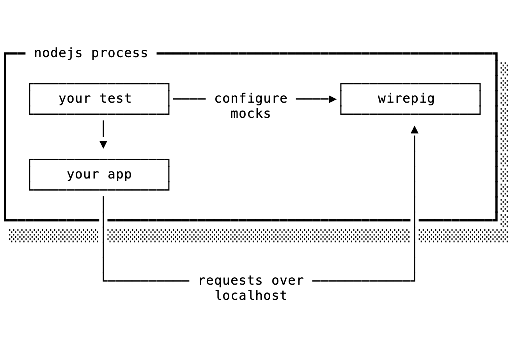

# wirepig [](https://github.com/griffinmyers/wirepig/actions/workflows/test.yaml) 

Wirepig helps you test software that relies on something over a network. If
your code talks to any of the following, then wirepig can help:

* **HTTP Services** (AWS, Twilio, another application you're building, ...)
* **Databases** (mysql, postgres, ...)
* **Caches** (redis, memcached, ...)
* **Rate Limiters** (divvy, ...)
* anything else accessed by a TCP connection

Wirepig spins up an HTTP or TCP server that can programmatically behave like your
software's actual dependencies. Simply tell wirepig what kinds of requests to
emulate and point your application at it. No monkey-patching the runtime, no
external processes, no dependency injection, just honest-to-goodness sockets.

<div align=center></div>

Requires [NodeJS `>=14`](https://nodejs.dev/en/about/releases/).

* [Documentation](/docs)
* [Types](/index.d.ts)

### Quick Start

Install with your favorite package manager:

###### npm
```console
npm install --save-dev wirepig
```

###### yarn
```console
yarn add --dev wirepig
```

Pull in however you get your modules:

###### ESM
```js
import { http, tcp, helpers, errors } from 'wirepig';
```

###### CommonJS
```js
const { http, tcp, helpers, errors } = require('wirepig');
```

And get to mocking:

```js
const dep = await http();

const mock = dep.mock({
  req: { method: 'POST', pathname: '/bloop' },
  res: { statusCode: 200, body: 'bloop' },
});

const res = await request.post(`http://localhost:${dep.port}/bloop`)

assert.strictEqual(res.statusCode, 200);
assert.strictEqual(res.text, 'bloop');

await dep.teardown();
```

Here we:

1. Initialized an HTTP server as a substitute for our dependency. It's listening
   on an ephemeral port and ready to go. See the [docs](./docs/http.md) if you
   need to start wirepig on a well-known port.
2. Declared a request we expect our server to receive from our application and
   the response to emit when it does. This mock will only handle a single
   request.
3. Instructed our application to make an HTTP request to our server and asserted
   the response we received. In reality, this network call would probably be
   buried deep within your application.
4. Closed our HTTP server.

It's **highly** recommended that you utilize a test runner's lifecycle hooks to
properly manage your mocks:

```js
before(async function () {
  this.dep = await tcp();
});

afterEach(function () {
  this.dep.reset();
});

after(async function () {
  await this.dep.teardown();
});

it('sends a GET request to redis', async function() {
  this.dep.mock({
    req: ['*2', '$3', 'GET', '$8', 'ns:bloop', ''].join('\r\n'),
    res: ['$17', 'bloop-the-big-one', ''].join('\r\n'),
  });

  const client = createClient({ url: `redis://localhost:${this.dep.port}` });
  await client.connect();

  assert.strictEqual(await client.get('ns:bloop'), 'bloop-the-big-one');

  await client.disconnect();
});
```

* **Before** the test suite runs, spin up the server you need.
* **After Each** test runs, reset the server. This will assert that all
  previously declared mocks have been satisfied and clear any internal state.
* **After** the test suite runs, close the server.
* **During** a test, declare any mocks needed.

Making sense? Head over to the [docs](/docs) for a full accounting of
what wirepig can do.

### Troubleshooting

When things get confounding, set the `NODE_DEBUG` environment variable to one
of the following:

| `$NODE_DEBUG` | Behavior |
| -- | -- |
| `wirepig`| Logs general diagnostics |
| `wirepig.match`| Logs diagnostics related to request matching |
| `wirepig*`| Logs all diagnostics |

With the expanded output in your console, you ought to be able to figure out
what's going on.

Alternatively, a tool like [Wireshark](https://www.wireshark.org/) can help you
monitor all packets flowing between your application and wirepig, and might
yield a clue.

### A Brief Note on the Design

Wirepig occupies a space similar to [nock](https://github.com/nock/nock) except
instead of overriding node internals, wirepig operates as an independent server
your application sends real requests to. Since you spin up wirepig in the same
process as your tests, you still have programmatic control over it.

I'm optimistic this design will offer a few notable upsides:

1. **Better Tests:** Overriding node internals in our tests means we aren't
  actually testing the networking stack used in production. Wirepig pushes the
  mocking boundary out of your application code and into the network itself
  while still being easy to operate.
2. **More Robust:** Node internals change on every release and may break any
  overriding (example: https://github.com/nock/nock/pull/1182). Since wirepig
  steers clear of that technique, it'll likely be robust to new versions of
  node.
3. **Tooling:** By sending packets out over a network, we get to
  leverage the deep bench of excellent networking tools available to us (like
  [Wireshark](https://www.wireshark.org/)).

The wirepig API strives to offer every desirable feature in a simple package,
often at the expense of terseness. For example, there's no built-in magic for
handling JSON, even though it's an exceptionally common serialization format
(there are some handy [helpers](./docs/helpers.md), though).
First and foremost, wirepig wants to be a strong foundation other projects can
build on top of (for example, a redis-specific mocking library).

Of course, wirepig isn't the best tool for every job, and even though it can
technically mock a postgres database, that might not be the best idea depending
on your needs. Other tools I highly recommend:

* **[Docker Compose](https://docs.docker.com/compose/)** is a nice way to run
  tests against real applications like redis or mysql, if a bit heavyweight.
* **[Localstack](https://github.com/localstack/localstack)** does a remarkable
  job emulating AWS' public API.

### Contributing

I'm eager to hear from you! Feature requests, bug reports, general feedback, or
just an excuse to chat, drop into [issues](https://github.com/griffinmyers/wirepig/issues)
and let me know what's on your mind. I much prefer it over a pull request out of
the blue, if even so that we can get on the same page before you spend any time
working up a patch.
